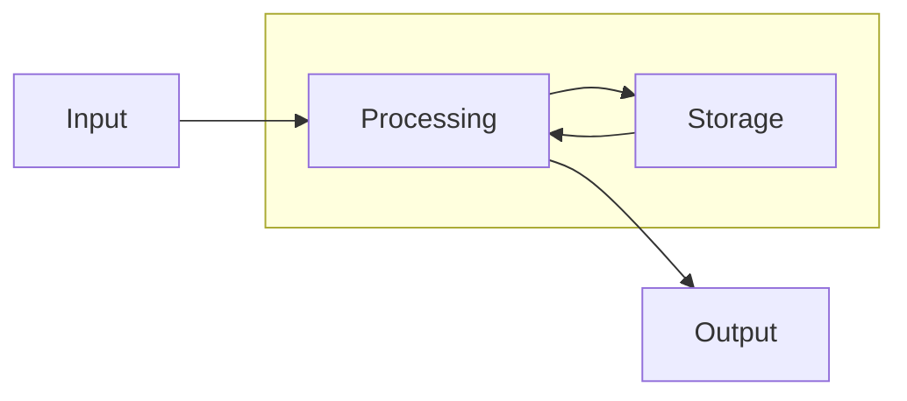

**Fundamentals of computer**
============================
 
## What is computer?

A computer is an electronic device that manipulates information, or data. It has the ability to store, retrieve, and process data. It can process information in very fast speed. You can use a computer to type documents, send email play games, and browse the Web. You can also use it to edit or create spreadsheets, presentations, and even videos

---

## Hardware
Hardware is any part of computer that has physical structure. Such as keyboard, mouse, processor, hard disk, or any other component. Hardware is used for getting input from user, processing and giving output to user.

Hardware are further categorized into several categories:  

**Input Devices** - Any device which is used to get input from user such as keyboard, mouse, scanner etc.  
  
**Output Devices** - Any device which provides output to user such as monitor, printer. 

**Storage Devices** - storage devices are used to store information. such as hard disk, Usb drive etc.

A modern computer is like a Lego, all components can be attached detached very easily.  

### **_Mother Board_**

The motherboard is the computer's main circuit board. It's a thin plate that holds the CPU, memory, connectors for the hard drive and optical drives, expansion cards to control the video and audio, and connections to your computer's ports (such as USB ports). The motherboard connects directly or indirectly to every part of the computer.

### **_Hard Disk_**

It is a magnetic storage device, made of multiple flat circular disks stacked on top of each other. The disks are made of glass and coated with magnetic material. Hard disks can store large amount of data.

It has a head ( just like the old music disk player ) which can read and write information to the disk. 

The data in hard disk are stored in binary format ( 0 or 1 ). In order to write data on to disk, the head magnetize a tiny spot on the disk for writing 1 and demagnetize for writing 0. 

And later when reading it can retrive the information by finding the magnetized/demagnetized spots.

### **_SSD_**

A solid-state drive (SSD) is a new generation of storage device used in computers. SSDs replace traditional mechanical hard disks by using flash-based memory, which is significantly faster. Older hard-disk storage technologies run slower, which often makes your computer run slower than it should. SSDs speed up computers significantly due to their low read-access times and fast throughputs.

### **_RAM ( Random Access Memory )_**

RAM is essentially your device’s short-term memory. It temporarily stores (remembers) everything that runs on your PC, like your web browser, your opened applications or the game you’re playing. Any program you load on your computer is first transferred from Hard Disk to RAM. 

Data that resides in the short-term memory, or RAM, can be read from anywhere at almost the same speed. Because it has a hard-wired connection to your system, there’s no real latency in cabling or connection.

RAM doesn’t remember everything forever, however. It’s a “volatile” technology, meaning that once it loses power, it forgets everything. That makes it perfect for handling the multitude of high-speed tasks that your system throws at it on a daily basis. But it’s also why we need storage systems like hard drives and SSDs, which actually hold our information when you turn the system off.

### **_Processor ( CPU )_**

The central processing unit (CPU), also called a processor, is located inside the computer case on the motherboard. It is sometimes called the brain of the computer, and its job is to carry out commands. Whenever you press a key, click the mouse, or start an application, you're sending instructions to the CPU.  
  
  
---

## Software
Software, also known as application or a computer program – is a collection of many lines of code.  
A smallest program can have hundreds of lines of codes in them. A large application can have billions of lines.

We call it code because it is a language which is understandable by computer. They are step by step instructions. Like a recipe which tells computers what to do with the data. 

Data is a pirce of information that the computer can hold in its memory. Computer takes information from user through input devices and provides it to program which tells processor what to do with the data. And once the processor finish processing the data, the program collects the output and presents it to the user.

### **_Operating System_**

An operating system is the most important software that runs on a computer. It manages the computer's memory and processes, as well as all of its software and hardware. It also allows you to communicate with the computer without knowing how to speak the computer's language. Without an operating system, a computer is useless.

An operating system takes many roles to manage the computer:  

**As a resource manager** - Operating system's job invludes managing resources like hard disk, ram etc when multiple tasks are running. 

It also prioritize which application should be executed first by the processor. Also when you save any document on microsoft word. Its the operating system which takes care of storing the information to the disk. 

**As an interface for programs** - It also provices an interface for other programs to run. When you write program in python, you just need to install python interpretor for your operating system. 

Any code you write in python is processed by the interpretor. The interpretor communicates with the operating system and the operating system runs the task on processor.

----

We can dive deeper into how the operating system works and other things like networks, wired, wifi etc. But for now lets start with some simple programming to get practicing. And we will touch these topics later as we progress.

## Tools for programming

In order to be able to run your own program, you need a software which takes your code and converts it into a format that CPU can understand. These software does the job of translator and also help us with the correct error messages in case we make some mistakes while writing our program. They are called compiler or interpreter.

**Compiler** - takes entire program and converts it into object code which is typically stored in a file. The object code is also refereed as binary code and can be directly executed by the machine after linking. Examples of compiled programming languages are C and C++.

**Interpreter** - An Interpreter directly executes instructions written in a programming or scripting language without previously converting them to an object code or machine code. Examples of interpreted languages are Perl, Python and Matlab.
  

Interpreters and compilers are very similar in structure. The main difference is that an interpreter directly executes the instructions in the source programming language while a compiler translates those instructions into efficient machine code.

---
## Installing python

To begin writing our program in python, first we need to download and install python interpreter on our computer. We are going to use anaconda software for pythong. Anaconda is a package which installs python along with most of the commly used tools which we will need to use in python later.  

Please download the anaconda from below link for windows 10:  
https://repo.anaconda.com/archive/Anaconda3-2020.02-Windows-x86_64.exe

For instructions on how to install anaconda, follow this link:
https://docs.anaconda.com/anaconda/install/windows/

    - how the program works on computer ( interpreter, compiler )
    - mental strategy 
    - structure of program
    - tools for programming ( python ) 

    * parts of program 
        - data types
        - values and expression
        - control structure  ( if/else, conditions)
        - iterations ( for, while )
        - functions ( grouping instructions together)

    * software development lifecycle
        - plan
        - development
        - testing
        - deployment ( launch ) final product

